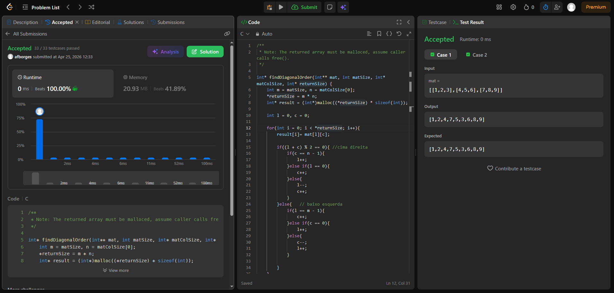

**Arthur Ferreira Borges - M1 - 25101666**

[498. Diagonal Traverse](https://leetcode.com/problems/diagonal-traverse/)

Given an `m x n` matrix `mat`, return  *an array of all the elements of the array in a diagonal order* .

**Example 1:**

<pre><strong>Input:</strong> mat = [[1,2,3],[4,5,6],[7,8,9]]
<strong>Output:</strong> [1,2,4,7,5,3,6,8,9]
</pre>

**Example 2:**

<pre><strong>Input:</strong> mat = [[1,2],[3,4]]
<strong>Output:</strong> [1,2,3,4]</pre>

**Example 3:**

<pre><strong>Input:</strong> mat = [[1,2],[3,4],[5,6]]
<strong>Output:</strong> [1,2,3,4,5,6]</pre>

ISSUE 1 - na linha que verifica qual direção devo percorrer a matriz, havia colocado (l *c) ao inves de (l + c), entao chegava em coordenadas da matriz que nao existiam e dava overflow

ISSUE 2 - depois de arrumar o primeiro problema, continuava dando erro de memoria em alguns casos da matriz, que eram os cantos inferior esquerdo e superior direito, pois estava verificando na ordem errada, primerio vinha (l ==0), que verifica se esta na primeira linha da matriz, e depois (c== m -1), que verifica se esta na ultima coluna da matriz, o que dava erro porque, no caso do primeiro exemplo, ia pra coluna 3, que nao existe. O mesmo erro acontecia no segundo bloco do codigo, a parte que vai para baixo e para a esquerda.

ISSUE 3 - no main que fiz em aula, fiz de maneira apressada para poder testar o codigo localmente, e acabei nao colocando o free no final do codigo, o que dava memory leak.
