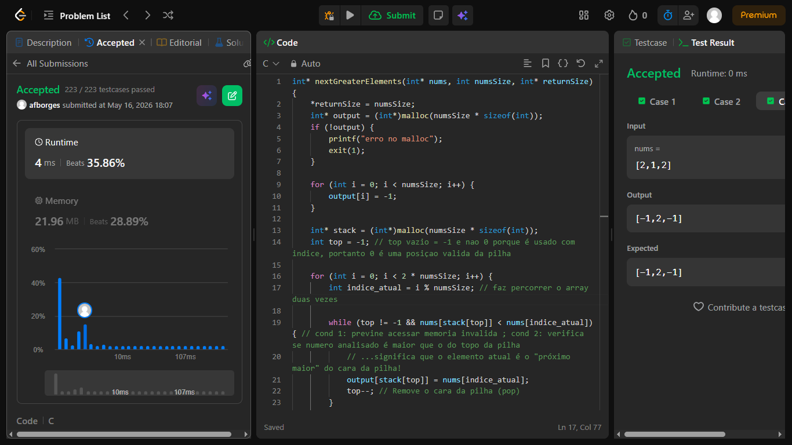

# Next Greater Element

Given a circular integer array `nums` (i.e., the next element of `nums[nums.length - 1]` is `nums[0]`), return *the **next greater number** for every element in* `nums`.

The **next greater number** of a number `x` is the first greater number to its traversing-order next in the array, which means you could search circularly to find its next greater number. If it doesn't exist, return `-1` for this number.

**Example 1:**

<pre><strong>Input:</strong> nums = [1,2,1]
<strong>Output:</strong> [2,-1,2]
Explanation: The first 1's next greater number is 2; 
The number 2 can't find next greater number. 
The second 1's next greater number needs to search circularly, which is also 2.
</pre>

**Example 2:**

<pre><strong>Input:</strong> nums = [1,2,3,4,3]
<strong>Output:</strong> [2,3,4,-1,4]</pre>

**Example 3:**

<pre><strong>Input:</strong> nums = [2,1,2]
<strong>Output:</strong> [-1,2,-1]</pre>

ISSUE 1: em todos os tstcases, o codigo falhava no ultimo element do array, acontecia porque no if(x > numsSize), para o ultimo elemento nao funciona ja que na ultima iteração, x é igual a numsSize, entao ele funcionava em todos e nunca chegava a entrar no if por causa deste problema.
